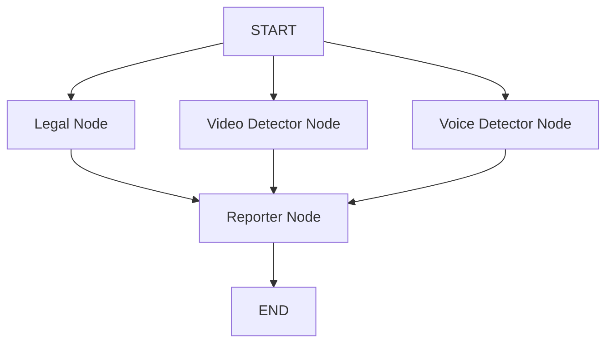

## Multi-Agent 기반 AI 모듈

- 법률 기반 허위/사기 광고 여부
- 딥페이크 광고 여부
- AI 생성 전문가 광고 여부

# System Architecture Overview
## Graph Structure

The system is built using **LangGraph** and follows a parallel execution pattern for analysis nodes, aggregating results in a final reporter node.



# Installation & Usage

## 1. Prerequisites
Ensure you have Python 3.10+ installed and a `.env` file with your `GOOGLE_API_KEY`.

## 2. Install Dependencies
```bash
pip install -r requirements.txt
```

## 3. Generate Vector Database
Before running the analysis, you must build the local vector database from the legal documents in the `laws/` directory.
```bash
python laws_embedding.py
```
This will create a `chroma_db_local` directory.

## 4. Run the Server
Start the FastAPI server:
```bash
python main.py
```
or 
```bash
python -m uvicorn main:app --reload
```
The server will start at `http://0.0.0.0:8000`.

## 5. API Usage
**Endpoint:** `POST /analyze`

**Request Body:**
```json
{
  "youtube_url": "https://www.youtube.com/watch?v=..."
}
```

**Response:**
```json
{
  "legal_issue": false,
  "deepfake_issue": true,
  "ai_voice_issue": false
}
```
