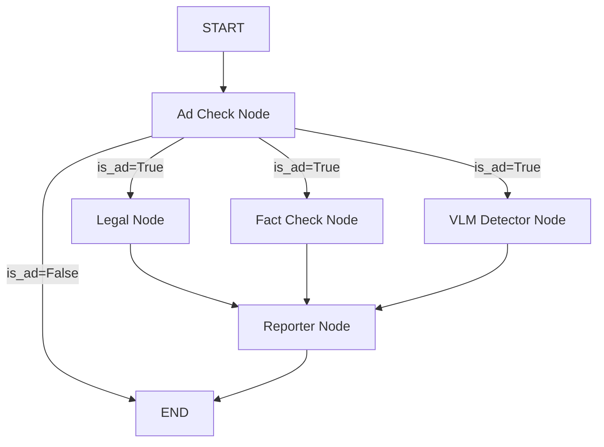

## Multi-Agent 기반 AI 판별 시스템

본 시스템은 유튜브 영상 및 스크립트를 분석하여 다음과 같은 위법 및 부적절한 콘텐츠를 자동으로 선별합니다.

- **법률 기반 분석**: 표시광고법, 식품위생법 등 법적 규정 위반 여부 (RAG 기반)
- **딥페이크 & AI 탐지**: 자체 모델/Gemini VLM을 활용한 페이스 스와프 및 AI 생성 전문가 탐지
- **팩트 체크**: 영상 내 주장의 사실 관계 확인

# System Architecture
## Graph Structure (LangGraph)

시스템은 **LangGraph**를 기반으로 설계되었으며, 분석 노드들이 병렬로 실행된 후 Reporter 노드에서 결과를 종합합니다.



## Key Features
1. **YouTube Automation**: URL 입력 시 영상 다운로드, 오디오 추출, 자막 생성(또는 추출) 자동화
2. **Video Clipping**: 분석 효율성을 위해 긴 영상의 중간 30초 영역을 자동으로 추출하여 분석
3. **Legal RAG**: ChromaDB에 저장된 최신 법조항 및 판례를 바탕으로 법적 리스크를 정밀 분석
4. **Multimodal Analysis**: Gemini 1.5/2.0 Flash 모델을 사용하여 영상과 텍스트를 동시에 분석

# Installation & Usage

## 1. Prerequisites
- Python 3.10+
- `.env` 파일에 `GOOGLE_API_KEY` 설정

## 2. Install Dependencies
```bash
pip install -r requirements.txt
```

## 3. Databases (Docker)
본 시스템은 도커를 통해 MySQL과 ChromaDB를 실행합니다.
```bash
docker compose up -d
```

## 4. Generate Vector Database
분석 전 `laws/` 디렉토리의 법률 문서를 기반으로 벡터 DB를 구축해야 합니다. (ChromaDB가 실행 중이어야 합니다.)
```bash
python laws_embedding.py
```

## 5. Run the Server
FastAPI 서버 실행:
```bash
python main.py
```
또는
```bash
python -m uvicorn main:app --reload
```

## 6. API Usage
**Endpoint:** `POST /analyze`

**Request Body:**
```json
{
  "youtube_url": "https://www.youtube.com/watch?v=..."
}
```

**Response Example:**
```json
{
  "legal": {
    "legal_issue_score": 0.9,
    "legal_issue_evidence": ["상당한 고수익 보장 표현", "의료법 위반 소지"]
  },
  "deepfake": {
    "deepfake_ai_score": 0.1,
    "deepfake_ai_evidence": ["부자연스러운 피부 질감"]
  },
  "fact": {
    "fake_score": 0.8,
    "fake_evidence": ["근거 없는 음모론 제기"]
  },
  "final_score": 0.9,
  "report": "... (종합 리포트)"
}
```
